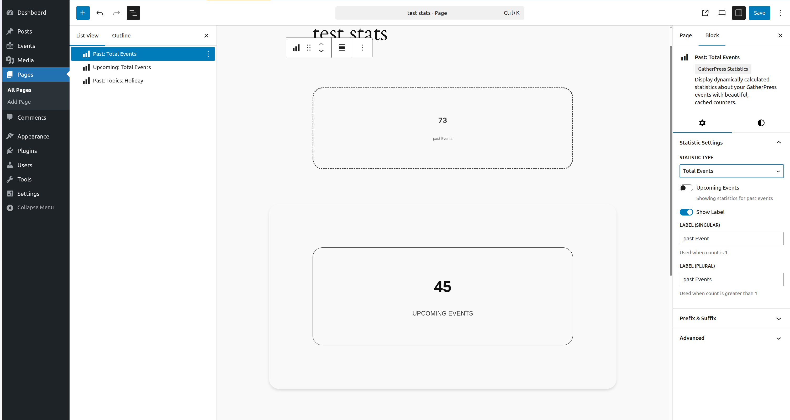
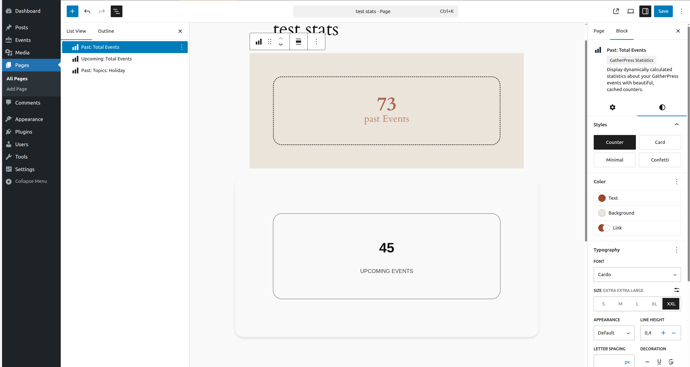
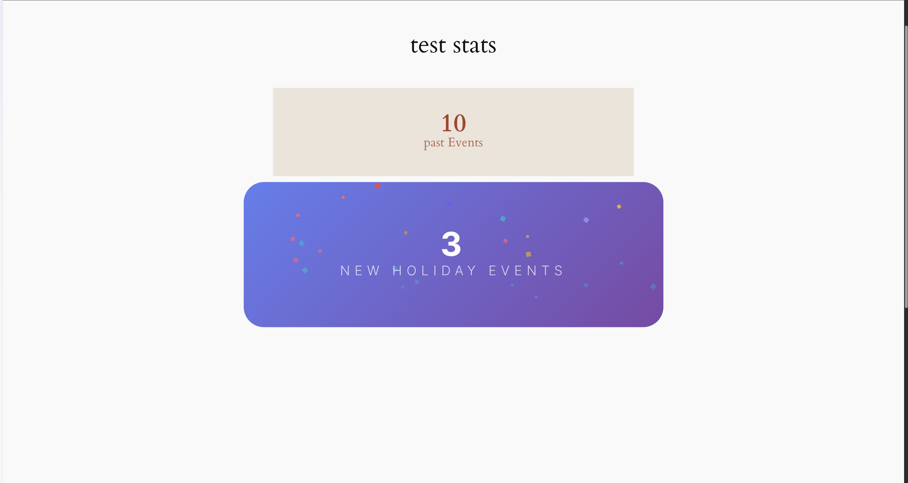
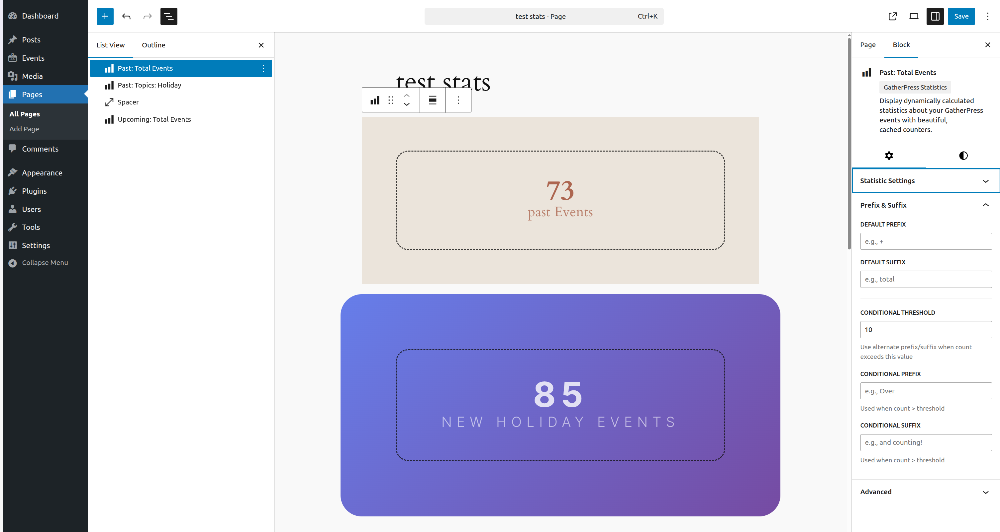

# GatherPress Statistics

Stable tag: 0.1.0  
Tested up to: 6.8  
License: GPL v2 or later  
Tags: block, gatherpress, events, statistics  
Contributors: carstenbach, WordPress Telex  

Display dynamically calculated statistics about your GatherPress events with beautiful, cached counters.

[](https://playground.wordpress.net/?blueprint-url=https://raw.githubusercontent.com/carstingaxion/gatherpress-statistics/main/.wordpress-org/blueprints/blueprint.json)

## Description

The GatherPress Statistics block is a powerful tool  to provide statistics about your GatherPress events, venues, and topics with intelligent caching for optimal performance and a modular architecture that lets you control exactly which statistics are available.

### Key Features:

* **Modular Statistics System:** Enable or disable individual statistic types via post type supports
* **Multiple Statistic Types:** Total events, events per taxonomy, multi-taxonomy filtering, attendee counts, and more
* **Smart Caching System:** All statistics are calculated on data change using WordPress hooks and cached as transients for lightning-fast performance
* **Dynamic Taxonomy Support:** Automatically works with all taxonomies registered to supported post types
* **Multiple Block Styles:** Choose from Counter, Card, Minimal, or Confetti display styles
* **Theme.json Integration:** Fully compatible with theme.json spacing, typography, and color settings
* **Conditional Formatting:** Show different prefix/suffix based on count thresholds
* **Event Time Filtering:** Separate statistics for upcoming and past events
* **Semantic HTML:** Uses proper HTML5 elements (`<figure>`, `<data>`, `<figcaption>`) for better accessibility

### Perfect For:

* Event organizers tracking attendance and engagement
* Community managers analyzing event distribution
* Website owners showcasing event statistics
* Marketing teams highlighting venue utilization

### How It Works:

The block uses WordPress hooks to monitor when GatherPress events, venues, or topics are created, updated, or deleted. When changes occur, statistics are recalculated in the background and stored as transients. The frontend simply displays the cached values, ensuring your site remains fast even with thousands of events.

### Behind the Scenes:

When you save an event, update attendee counts, or modify taxonomy terms, the plugin:
1. Clears all cached statistics (instant)
2. Schedules a background job to regenerate cache (60 seconds later)
3. Pre-generates ~50-60 common statistics (0.3-1.2 seconds, background)
4. Stores results as WordPress transients (default 12-hour expiration, customizable via filter)
5. Frontend blocks retrieve cached values (0.001 seconds)

== Installation ==

1. Upload the plugin files to the `/wp-content/plugins/gatherpress-statistics` directory
2. Activate the plugin through the 'Plugins' screen in WordPress
3. Ensure GatherPress plugin is installed and activated
4. Add the "GatherPress Statistics" block to any post or page
5. Configure your desired statistic type and filters in the block settings

## Frequently Asked Questions

### Does this require GatherPress to be installed?

Yes, this block is designed to work with the GatherPress event management plugin. It queries GatherPress custom post types and taxonomies.

### How often are statistics updated?

Statistics are updated immediately when events, venues, or topics are created, modified, or deleted. The caching system ensures changes are reflected instantly while maintaining performance.

### Can I display multiple statistics on one page?

Absolutely! Add multiple instances of the block, each configured to show different statistics.

### How long are statistics cached?

By default, statistics are cached for 12 hours. However, the cache is automatically cleared and regenerated whenever relevant data changes. You can customize the cache duration using the `gatherpress_statistics_cache_expiration` filter.

### Can I customize the appearance?

Yes! The block supports four built-in styles (Counter, Card, Minimal, Confetti) and fully respects your theme's color, typography, and spacing settings via theme.json. You can also use conditional prefix/suffix formatting based on count thresholds.

### Will this slow down my site?

No! The block is designed with performance as a top priority. All heavy calculations happen in the background when data changes, not during page loads. Frontend rendering is nearly instant using cached values.

### What happens with custom GatherPress taxonomies?

The block automatically detects and works with any taxonomies registered to the `gatherpress_event` post type. You don't need to modify any code when adding new taxonomies.

### Can I show statistics for all events (upcoming and past combined)?

No. The plugin requires you to choose either upcoming or past events. This is by design to ensure accurate and meaningful statistics.

### How do I style the number and label differently?

See the "Styling with theme.json" section below for detailed examples of targeting specific elements.

## Screenshots

1. 
2. 
3. Card style showing events per topic with elegant design
4. Minimal style integrated seamlessly into content
5. 
6. Inspector controls for configuring statistics and filters
7. Multiple taxonomy filter panel for complex queries
8. 

## Block Usage

### Basic Usage

1. Add the "GatherPress Statistics" block to your post or page
2. Select a statistic type from the sidebar
3. Choose between upcoming or past events (where applicable)
4. Configure labels and formatting options
5. Apply filters if needed (taxonomy, terms, etc.)

### Event Time Filtering

Most statistics support filtering by event time:

- **Upcoming Events**: Events scheduled in the future
- **Past Events**: Events that have already occurred

Note: This filter is not available for taxonomy term counts.

### Single Taxonomy Filtering

For "Events per Taxonomy Term" and "Total Attendees" statistics:

1. Select a taxonomy (e.g., "Topics")
2. Choose a specific term (e.g., "WordPress")
3. Statistics will show only events with that term

### Multiple Taxonomy Filtering

For "Events (Multiple Taxonomies)" statistics:

1. Expand each taxonomy panel in the sidebar
2. Select multiple terms from each taxonomy
3. Events must match ALL selected terms (AND relationship)

Example: Select "WordPress" from Topics AND "Beginner" from Skill Level

### Conditional Formatting

Customize the display based on count thresholds:

1. Set a threshold number (e.g., 10)
2. Define default prefix/suffix (e.g., "Total" / "events")
3. Define conditional prefix/suffix (e.g., "Over" / "and counting!")
4. When count exceeds threshold, conditional values are used

### Block Styles

- **Counter** (default): Large number with label below
- **Card**: Elevated card design with shadow
- **Minimal**: Compact display with smaller text
- **Confetti**: Gradient background with hover animation

== Styling with theme.json ==

### HTML Structure

The block uses semantic HTML for better accessibility and styling:

```html
<figure class="wp-block-gatherpress-statistics">
  <data class="gatherpress-stats-value" value="42">
    <span class="gatherpress-stats-prefix">Over</span>
    <span class="gatherpress-stats-number">42</span>
    <span class="gatherpress-stats-suffix">and counting</span>
  </data>
  <figcaption class="gatherpress-stats-label">Events</figcaption>
</figure>
```

### Key Elements:

- **`<figure>`**: Container with block classes and styles
- **`<data>`**: Holds the numeric value with machine-readable `value` attribute
- **`<span class="gatherpress-stats-number">`**: The actual statistic number
- **`<span class="gatherpress-stats-prefix">`**: Optional prefix text (e.g., "Over", "+")
- **`<span class="gatherpress-stats-suffix">`**: Optional suffix text (e.g., "total", "and counting")
- **`<figcaption>`**: The descriptive label

### Styling the Number Separately

Target the `.gatherpress-stats-number` class to style just the number:

```json
{
  "version": 2,
  "styles": {
    "blocks": {
      "gatherpress/statistics": {
        "elements": {
          ".gatherpress-stats-number": {
            "typography": {
              "fontSize": "4rem",
              "fontWeight": "900",
              "lineHeight": "1"
            },
            "color": {
              "text": "var(--wp--preset--color--primary)"
            }
          }
        }
      }
    }
  }
}
```

### Styling the Label Separately

Target the `.gatherpress-stats-label` class:

```json
{
  "version": 2,
  "styles": {
    "blocks": {
      "gatherpress/statistics": {
        "elements": {
          ".gatherpress-stats-label": {
            "typography": {
              "fontSize": "0.875rem",
              "fontWeight": "600",
              "textTransform": "uppercase",
              "letterSpacing": "0.05em"
            },
            "color": {
              "text": "var(--wp--preset--color--contrast)"
            },
            "spacing": {
              "margin": {
                "top": "0.5rem"
              }
            }
          }
        }
      }
    }
  }
}
```

### Styling Prefix and Suffix

```json
{
  "version": 2,
  "styles": {
    "blocks": {
      "gatherpress/statistics": {
        "elements": {
          ".gatherpress-stats-prefix, .gatherpress-stats-suffix": {
            "typography": {
              "fontSize": "0.75em",
              "fontWeight": "600"
            },
            "color": {
              "text": "var(--wp--preset--color--secondary)"
            }
          }
        }
      }
    }
  }
}
```

### Complete Styling Example

```json
{
  "version": 2,
  "styles": {
    "blocks": {
      "gatherpress/statistics": {
        "spacing": {
          "padding": "2rem"
        },
        "border": {
          "radius": "8px"
        },
        "color": {
          "background": "var(--wp--preset--color--base)",
          "text": "var(--wp--preset--color--contrast)"
        },
        "elements": {
          ".gatherpress-stats-value": {
            "spacing": {
              "margin": {
                "bottom": "1rem"
              }
            }
          },
          ".gatherpress-stats-number": {
            "typography": {
              "fontSize": "clamp(3rem, 8vw, 5rem)",
              "fontWeight": "900",
              "lineHeight": "1"
            },
            "color": {
              "text": "var(--wp--preset--color--primary)"
            }
          },
          ".gatherpress-stats-prefix, .gatherpress-stats-suffix": {
            "typography": {
              "fontSize": "1rem",
              "fontWeight": "600"
            },
            "color": {
              "text": "var(--wp--preset--color--secondary)"
            }
          },
          ".gatherpress-stats-label": {
            "typography": {
              "fontSize": "1.25rem",
              "fontWeight": "500",
              "textTransform": "uppercase",
              "letterSpacing": "0.1em"
            },
            "color": {
              "text": "var(--wp--preset--color--contrast)"
            }
          }
        },
        "variations": {
          "card": {
            "shadow": "0 4px 6px -1px rgb(0 0 0 / 0.1)",
            "elements": {
              ".gatherpress-stats-number": {
                "typography": {
                  "fontSize": "4.5rem"
                }
              }
            }
          },
          "minimal": {
            "spacing": {
              "padding": "1rem"
            },
            "elements": {
              ".gatherpress-stats-number": {
                "typography": {
                  "fontSize": "2rem"
                }
              },
              ".gatherpress-stats-label": {
                "typography": {
                  "fontSize": "0.875rem"
                }
              }
            }
          }
        }
      }
    }
  }
}
```

### Responsive Typography

Use `clamp()` for fluid typography:

```json
{
  "elements": {
    ".gatherpress-stats-number": {
      "typography": {
        "fontSize": "clamp(2.5rem, 6vw + 1rem, 5rem)"
      }
    },
    ".gatherpress-stats-label": {
      "typography": {
        "fontSize": "clamp(0.875rem, 2vw + 0.5rem, 1.25rem)"
      }
    }
  }
}
```

== Developer Documentation ==

### Architecture Overview:

The plugin uses a layered architecture for optimal performance:
1. **Post Type Support Layer:** Controls which statistics are available
2. **Data Layer:** WordPress hooks monitor all relevant data changes
3. **Scheduling Layer:** Changes trigger scheduled cache regeneration (60s delay)
4. **Calculation Layer:** Efficient WP_Query-based calculations
5. **Cache Layer:** WordPress transients store results
6. **Presentation Layer:** Block renders cached data

### Example Data Structure (15 events, 3 topics, 3 venues):

Setup:
- Events: E1-E15 (8 upcoming, 7 past)
- Topics: Technology (ID: 1), Workshop (ID: 2), Networking (ID: 3)
- Venues: Downtown Hall (ID: 4), Tech Center (ID: 5), Community Space (ID: 6)
- Attendees: Varying from 10-50 per event

Event Distribution:
- E1, E2, E6, E9: Technology, Downtown Hall (upcoming, 100 attendees)
- E3, E7, E10: Technology, Tech Center (past, 75 attendees)
- E4, E8: Workshop, Tech Center (upcoming, 45 attendees)
- E5, E11, E14: Workshop, Community Space (past, 80 attendees)
- E12: Technology, Downtown Hall (past, 25 attendees)
- E13: Workshop, Tech Center (past, 15 attendees)
- E15: Networking, Community Space (upcoming, 40 attendees)

Cached Statistics Examples:

```php
// Total counts by event query
get_transient( 'gatherpress_stats_total_events_upcoming_abc123' ); // Returns: 8
get_transient( 'gatherpress_stats_total_events_past_def456' );     // Returns: 7
get_transient( 'gatherpress_stats_total_attendees_past_jkl012' );  // Returns: 195

// Per taxonomy
get_transient( 'gatherpress_stats_total_taxonomy_terms_mno345' ); // 3 topics
get_transient( 'gatherpress_stats_total_taxonomy_terms_pqr678' ); // 3 venues

// Per term with event query
get_transient( 'gatherpress_stats_events_per_taxonomy_upcoming_stu901' ); // 4 (upcoming Technology events)
get_transient( 'gatherpress_stats_events_per_taxonomy_past_vwx234' );    // 3 (past Technology events)
get_transient( 'gatherpress_stats_total_attendees_past_bcd890' );        // 100 (past Technology attendees)

// Cross-taxonomy
get_transient( 'gatherpress_stats_taxonomy_terms_by_taxonomy_efg123' ); // 2 (venues with Tech events)
```

### Configuration Guide

**Post Type Support System**

The plugin uses WordPress post type supports to provide granular control over functionality. By default, it registers support for `gatherpress_event` with all statistic types enabled:

```php
add_post_type_support( 'gatherpress_event', 'gatherpress_statistics', array(
    'total_events' => true,                // Total event counts
    'events_per_taxonomy' => true,         // Events filtered by single taxonomy
    'events_multi_taxonomy' => false,      // Events filtered by multiple taxonomies
    'total_taxonomy_terms' => false,       // Count of taxonomy terms
    'taxonomy_terms_by_taxonomy' => false, // Cross-taxonomy term counts
    'total_attendees' => true,             // Attendee counts
) );
```

**Available Statistic Types**

1. **total_events** - Count all events (with optional filters)
2. **events_per_taxonomy** - Count events in a specific taxonomy term
3. **events_multi_taxonomy** - Count events matching multiple taxonomy terms (AND relationship)
4. **total_taxonomy_terms** - Count total terms in a taxonomy
5. **taxonomy_terms_by_taxonomy** - Count terms from one taxonomy that have events in another
6. **total_attendees** - Sum of attendees across events (with optional filters)

**Modifying Default Configuration**

Use the `gatherpress_statistics_support_config` filter to customize which statistic types are enabled:

```php
add_filter( 'gatherpress_statistics_support_config', function( $config ) {
    // Disable complex statistics for better performance
    $config['events_multi_taxonomy'] = false;
    $config['taxonomy_terms_by_taxonomy'] = false;
    
    // Enable all basic statistics
    $config['total_events'] = true;
    $config['total_attendees'] = true;
    $config['events_per_taxonomy'] = true;
    
    return $config;
} );
```

**Adding Support to Custom Post Types**

Extend the plugin to work with your custom event post types:

```php
add_action( 'init', function() {
    add_post_type_support( 'my_event_cpt', 'gatherpress_statistics', array(
        'total_events' => true,
        'events_per_taxonomy' => true,
        'total_attendees' => false,  // Don't track attendees for this type
    ) );
}, 20 );
```


```php
/**
 * Exclude specific taxonomies from statistics.
 *
 * This filter allows developers to exclude taxonomies from both
 * statistics generation and block editor selection.
 *
 * Note: `_gatherpress_venue` is excluded by default.
 *
 * @since 0.1.0
 *
 * @param array $excluded_taxonomies Array of taxonomy slugs to exclude.
 * @param bool  $for_editor         Whether this is for editor selection.
 * @return array Modified array of excluded taxonomy slugs.
 */
add_filter( 'gatherpress_statistics_excluded_taxonomies', function( $excluded, $for_editor ) {
    // Exclude custom taxonomies from statistics
    $excluded[] = 'post_tag';
    $excluded[] = 'custom_event_type';
    return $excluded;
}, 10, 2 );
```


```php
/**
 * Modify cache expiration time.
 *
 * Default is 12 hours (43200 seconds). Change this to adjust how long
 * statistics remain cached before automatic expiration.
 *
 * @since 0.1.0
 *
 * @param int $expiration Cache expiration time in seconds.
 * @return int Modified expiration time.
 */
add_filter( 'gatherpress_statistics_cache_expiration', function( $expiration ) {
    // Cache for 6 hours instead of 12
    return 6 * HOUR_IN_SECONDS;
} );

// Example: Cache for 1 hour
add_filter( 'gatherpress_statistics_cache_expiration', function( $expiration ) {
    return HOUR_IN_SECONDS;
} );

// Example: Cache for 24 hours
add_filter( 'gatherpress_statistics_cache_expiration', function( $expiration ) {
    return DAY_IN_SECONDS;
} );
```


```php
/**
 * Filter calculated statistics before caching.
 *
 * Available filters for each statistic type:
 * - gatherpress_stats_calculate_total_events
 * - gatherpress_stats_calculate_events_per_taxonomy
 * - gatherpress_stats_calculate_events_multi_taxonomy
 * - gatherpress_stats_calculate_total_taxonomy_terms
 * - gatherpress_stats_calculate_taxonomy_terms_by_taxonomy
 * - gatherpress_stats_calculate_total_attendees
 *
 * @since 0.1.0
 *
 * @param int   $count   The calculated statistic value.
 * @param array $filters The filters applied to this statistic.
 * @return int Modified statistic value.
 */

// Example: Round counts to nearest 10 when over 50
add_filter( 'gatherpress_stats_calculate_total_events', function( $count, $filters ) {
    if ( $count > 50 ) {
        return round( $count / 10 ) * 10;
    }
    return $count;
}, 10, 2 );

// Example: Round based on value ranges
add_filter( 'gatherpress_stats_calculate_total_attendees', function( $count, $filters ) {
    // Round to nearest 5 if between 10-50
    if ( $count >= 10 && $count <= 50 ) {
        return round( $count / 5 ) * 5;
    }
    // Round to nearest 10 if between 50-100
    if ( $count > 50 && $count <= 100 ) {
        return round( $count / 10 ) * 10;
    }
    // Round to nearest 50 if over 100
    if ( $count > 100 ) {
        return round( $count / 50 ) * 50;
    }
    return $count;
}, 10, 2 );

// Example: Apply a custom multiplier
add_filter( 'gatherpress_stats_calculate_total_events', function( $count, $filters ) {
    // Apply a 1.5x multiplier to all event counts
    return round( $count * 1.5 );
}, 10, 2 );
```

### Performance Metrics:

- Cache hit: ~0.001 seconds
- Cache miss + calculation: ~0.005-0.02 seconds per statistic
- Full cache regeneration (50-60 stats): ~0.3-1.2 seconds (background)
- Database impact: Minimal (uses transients, cleared automatically)

### Cache Invalidation Triggers:

The plugin uses a smart cache invalidation system that balances freshness with performance:

#### Trigger Events:

1. Event post status changes to/from 'publish' (`transition_post_status`)
2. Attendee count meta field updated (`updated_post_meta`, `added_post_meta`, `deleted_post_meta`)
3. GatherPress taxonomy terms created, edited, or deleted (`create_term`, `edit_term`, `delete_term`)
4. Taxonomy term relationships change (`set_object_terms`)

#### Cache Clearing Process:

1. Trigger event occurs (e.g., event published)
2. All statistics transients deleted immediately from database
3. Single cron job scheduled to run in 60 seconds
4. Additional triggers within 60s don't schedule duplicate jobs
5. After 60s, background regeneration creates ~50-60 common statistics
6. Each statistic cached with configured expiration (default 12 hours)

#### Why 60-second delay?

- Prevents multiple regenerations during bulk operations
- Avoids resource exhaustion during large imports
- Allows all related changes to complete first
- Doesn't block or slow down admin operations

#### Manual Cache Clearing:

```php
// Clear cache programmatically
\GatherPressStatistics\clear_cache();

// Force immediate regeneration (use sparingly)
\GatherPressStatistics\clear_cache();
\GatherPressStatistics\pregenerate_cache();
```


## Changelog

###  0.1.0
* Initial release
* Support GatherPress post types & with any taxonomies
* Filtering for upcoming or past events
* Smart caching system with automatic invalidation
* Scheduled cache regeneration system
* Four display style variations including animated Confetti style
* Full theme.json integration
* Comprehensive taxonomy filtering
* Attendee count statistics
* Conditional prefix/suffix formatting
* Comprehensive documentation and developer hooks
* Semantic HTML structure with `<figure>`, `<data>`, and `<figcaption>` elements


## Privacy & Data

This plugin does not collect, store, or transmit any personal data. It only queries and caches statistics about your events and taxonomies. All data is stored locally in your WordPress database using the transients API.
